<style type="text/css">
.main-container {
  max-width: 1800px;
  margin-left: auto;
  margin-right: auto;
}
</style>


# A Data Analysis Report {.tabset}


Sofie Raeymakers


***

## Intro

explaination study

## Vigilance

we want to see if PVT/vigilance is different in day 1 compared to day 2 and in HCl compared to LCl (Condition) before the test


```r
##########################################
  ### PVT/VIGILANCE/RT ###
#########################################

#### DOWNLOAD + CLEAN DATA ####

#Download PVT data (this datafile is made in 'preprocessing')
data <- read.csv(paste0(Dir, "PVT.csv"), header = TRUE, sep = )
# mean 1/RT
data$RT <- 1/(data$RT/1000) #1/RT  ==> other result

## CREATE DATAFRAME  with the MeanRT per ID, Day, Condition
PVT <- as.data.frame(group_by(data, Test, Day, Condition, ID) %>%
  summarise(
    count = n(),
    Mean = mean(RT, na.rm = TRUE)
  ))
PVT <- PVT[!(PVT$Test==2),] # we will only look at before-test measures

# visualise RT's: from 0 to 10 seconds 
d<-melt(data.frame(RT=c(PVT$Mean))) # we melt to wide format
distribution_plot (d, 'Mean')
```

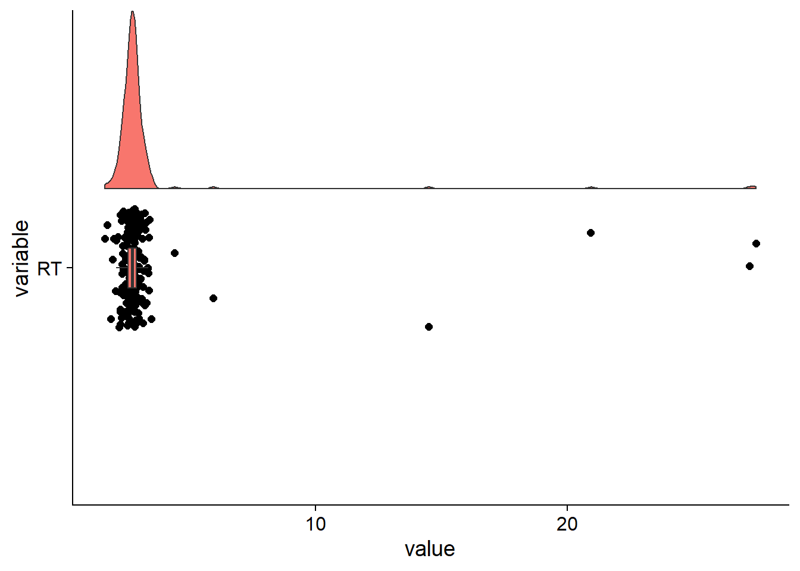<!-- -->

```r
qqPlot(PVT$Mean) # clearly not a normal distribution: a big skew 
```

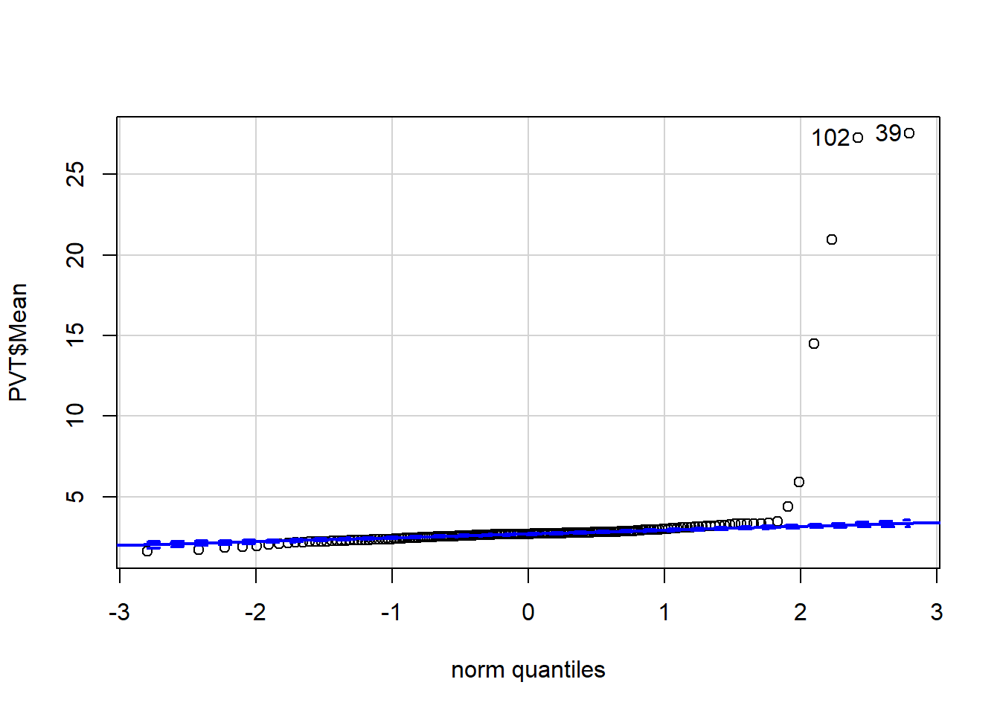<!-- -->

```
## [1]  39 102
```

```r
# make factors
PVT$Day <- factor(PVT$Day)
PVT$ID <- factor(PVT$ID)
PVT$Condition <- factor(PVT$Condition)


### CHECKING ASSUMPTIONS ####
# Time x Condition 2-way ANOVA with interaction effect (what Borrogan did)
res.aov2 <- aov(Mean ~ Condition * Day, data= PVT)
summary(res.aov2)# no sign! this is good, means vigilance was same in all conditions
```

```
##                Df Sum Sq Mean Sq F value Pr(>F)
## Condition       1    7.2   7.168   0.814  0.368
## Day             1    1.7   1.708   0.194  0.660
## Condition:Day   1    5.4   5.383   0.611  0.435
## Residuals     190 1673.4   8.807
```

```r
# HOMOGENEITY OF VARIANCE
plot(res.aov2, 1) # residuqls vs fits plot shows no evident relationship residuals and fitted values (means of groups)
```

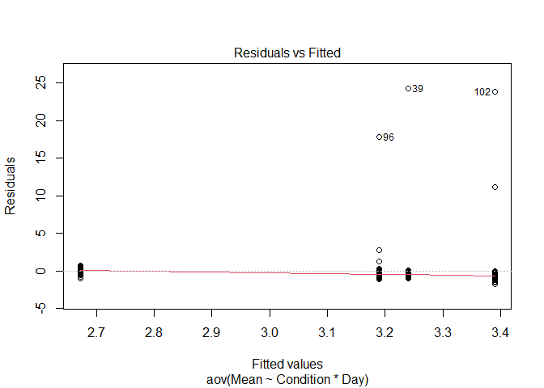<!-- -->

```r
# NORMALITY
aov_residuals <- residuals (object=res.aov2)
shapiro.test(x=aov_residuals) # no normality! 
```

```
## 
## 	Shapiro-Wilk normality test
## 
## data:  aov_residuals
## W = 0.23635, p-value < 2.2e-16
```

```r
# PVT %>%
#   group_by(Condition, Day) %>%
#   shapiro.test(Mean) # no normal distribution!
#visualisation
plot(res.aov2, 2) #clearly not normal
```

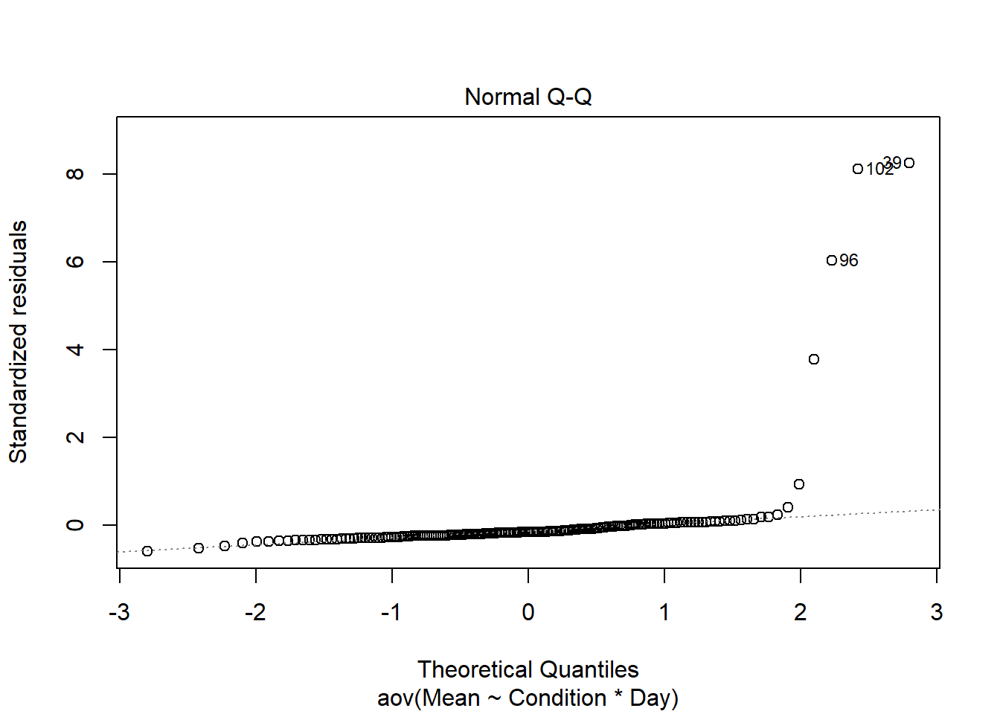<!-- -->

```r
ggqqplot(PVT, "Mean", ggtheme = theme_bw()) +
  facet_grid(Day ~ Condition)
```

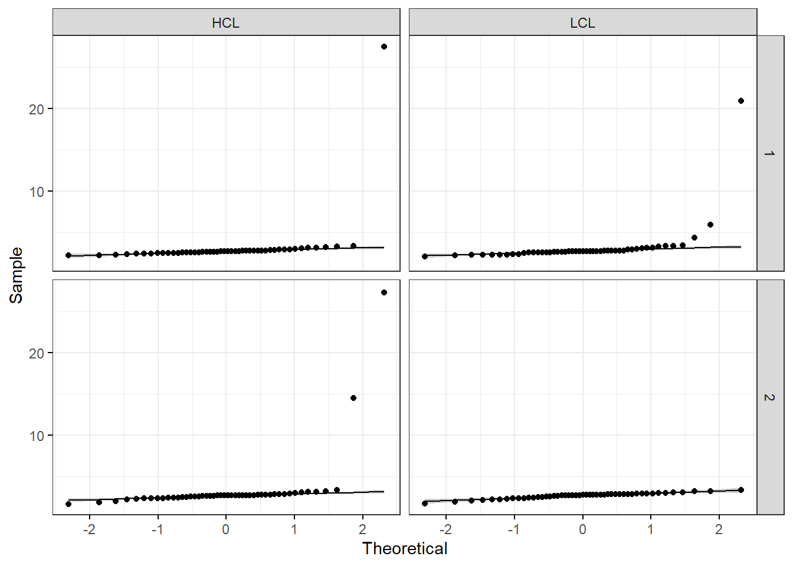<!-- -->

```r
ggqqplot(PVT, "Mean", ggtheme = theme_bw()) +
  facet_grid( ~Condition) #  very obviously NOT a normal distribution
```

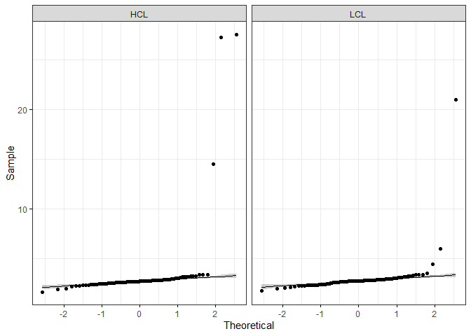<!-- -->

```r
# OUTLIERS
summary(PVT$Mean)
```

```
##    Min. 1st Qu.  Median    Mean 3rd Qu.    Max. 
##   1.619   2.536   2.709   3.121   2.855  27.521
```

```r
outliers <- boxplot(PVT$Mean, plot=FALSE)$out
# remove 
PVT<- PVT[-which(PVT$Mean %in% outliers),]
#visualise
d<-melt(data.frame(RT=c(PVT$Mean))) # we melt to wide format
distribution_plot (d, 'Mean') # much better
```

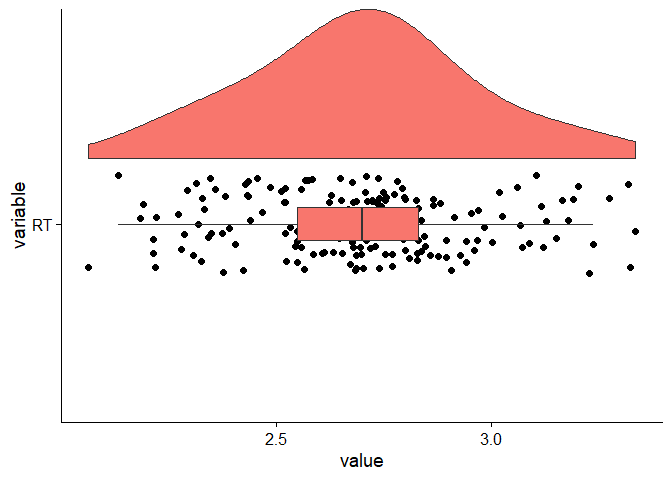<!-- -->

```r
qqPlot(PVT$Mean) # much better
```

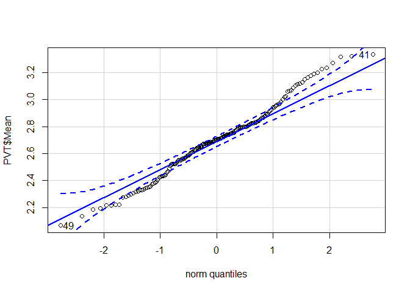<!-- -->

```
## [1] 41 49
```

```r
### ANALYSIS ###
#https://www.frontiersin.org/articles/10.3389/fpsyg.2015.01171/full
#https://stats.stackexchange.com/questions/254361/modeling-reaction-time-with-glmer
# => glmer with inverse link: can handle RT that is not normally distributed
d0.1 <- glmer (Mean~Condition * Day  + (1|ID), data= PVT, family= inverse.gaussian(link="identity"))
d0.2<- glmer (Mean~Condition * Day  + (1|ID), data= PVT, family= Gamma)
d0.3 <- glmer (Mean~Condition * Day  + (1|ID), data= PVT, family= gaussian)
tabel <- cbind(AIC(d0.1, d0.2, d0.3)) 
two_w<- glmer (Mean~Condition * Day  + (1|ID), data= PVT, family= Gamma)
emmeans1<- emmeans(two_w, pairwise ~ Condition * Day, adjust ="fdr", type = "response")
emmean_dataframe <- summary(emmeans1)$emmeans

Anova(two_w, type='III')
```

```
## Analysis of Deviance Table (Type III Wald chisquare tests)
## 
## Response: Mean
##                   Chisq Df Pr(>Chisq)    
## (Intercept)   2879.0223  1    < 2e-16 ***
## Condition        0.1854  1    0.66681    
## Day              5.6738  1    0.01722 *  
## Condition:Day    4.6655  1    0.03077 *  
## ---
## Signif. codes:  0 '***' 0.001 '**' 0.01 '*' 0.05 '.' 0.1 ' ' 1
```

```r
summary(emmeans1) ## Result the SAME for data with or without outliers (PVT & PVT2): because it is glmer
```

```
## $emmeans
##  Condition Day response     SE  df asymp.LCL asymp.UCL
##  HCL       1       2.68 0.0499 Inf      2.58      2.78
##  LCL       1       2.65 0.0491 Inf      2.56      2.75
##  HCL       2       2.61 0.0485 Inf      2.52      2.71
##  LCL       2       2.67 0.0494 Inf      2.57      2.77
## 
## Confidence level used: 0.95 
## Intervals are back-transformed from the inverse scale 
## 
## $contrasts
##  contrast      estimate      SE  df z.ratio p.value
##  HCL 1 - LCL 1 -0.00423 0.00983 Inf  -0.431  0.8002
##  HCL 1 - HCL 2 -0.00915 0.00384 Inf  -2.382  0.1033
##  HCL 1 - LCL 2 -0.00146 0.00978 Inf  -0.150  0.8811
##  LCL 1 - HCL 2 -0.00492 0.00993 Inf  -0.495  0.8002
##  LCL 1 - LCL 2  0.00277 0.00397 Inf   0.698  0.8002
##  HCL 2 - LCL 2  0.00769 0.00988 Inf   0.778  0.8002
## 
## Note: contrasts are still on the inverse scale 
## P value adjustment: fdr method for 6 tests
```

```r
# but removing the outliers makes visualisations much more readable
#summary 
sum <- sum_2 (PVT, 'Day', 'Condition', 'Mean')
sum
```

```
## # A tibble: 4 x 7
## # Groups:   Day [2]
##   Day   Condition     n  mean    sd     se     ic
##   <fct> <fct>     <int> <dbl> <dbl>  <dbl>  <dbl>
## 1 1     HCL          47  2.72 0.267 0.0390 0.0784
## 2 1     LCL          43  2.67 0.260 0.0396 0.0799
## 3 2     HCL          43  2.69 0.250 0.0381 0.0769
## 4 2     LCL          45  2.71 0.260 0.0388 0.0781
```
### VISUALISATIONS

```r
### VISUALISATION ###
# boxplot 
bxp <- ggboxplot(
  PVT, x = "Day", y = "Mean",
  color = "Condition", palette = "jco")
bxp
```

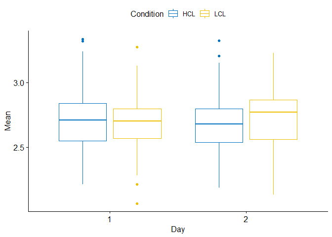<!-- -->

```r
## plot with error bars
pl <- plotty(PVT, emmean_dataframe, 'Day',  'Mean', 'Condition', 'response', 'Vigilance') 
  #   geom_segment(aes(x =0.9, y = max_y+max_y/15, xend = 1.1, yend = max_y+max_y/15), size= 1)+ # top line
  # annotate('text', x=1, y=max_y+max_y/15+max_y/100, label='**', size=7)+ # tar
  #   geom_segment(aes(x =1.9, y = max_y+max_y/15, xend = 2.1, yend = max_y+max_y/15), size= 1) # top line
  # # annotate('text', x=2, y=max_y+max_y/15+max_y/100, label='*', size=7) # star
ggsave(pl, file=paste0(plotPrefix, "PVT_Plot.jpeg"), width = 2500, height = 1500, dpi = 300, units = "px")
pl
```

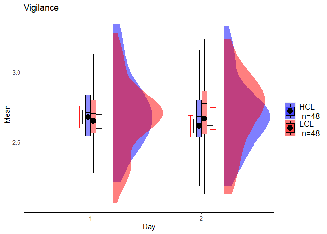<!-- -->
--------------------------------------------------------------

## Subjective CF: VAS-f

= subjective measure of fatigue on 1-10 scale
we want to know if there is a difference in VAS before and after Test


```r
##########################################
  ### VAS-f: fatigue ###
#########################################

#### DOWNLOAD + CLEAN DATA ####
data <- read.csv(paste0(Dir, "VAS.csv"), header = TRUE, sep = )
data <-data[(grepl("quantised", data$Question.Key)),] #VAS has 'quantised: 1-11 instead of 0-10
# create dataframe
VAS <- as.data.frame(group_by(data, Test, Day, Condition, ID) %>%
  summarise(
    count = n(),
    Mean = mean(Response, na.rm = TRUE)
  )) # we do Mean instead of Difference 2-1/1. Reason: this led to non-normal data


#factors
VAS$Day <- as.factor(VAS$Day)
VAS$Condition <- as.factor(VAS$Condition)
VAS$ID <- as.factor(VAS$ID)
names(VAS)[names(VAS)=="Test"] <- "Time"
VAS$Time <- as.factor(VAS$Time)

### CHECKING ASSUMPTIONS ####
# Time x Condition 2-way ANOVA with interaction effect (what Borrogan did)
res.aov2 <- aov(Mean ~ Condition * Day, data= VAS)
summary(res.aov2)# no sign! this is good, means vigilance was same in all conditions
```

```
##                Df Sum Sq Mean Sq F value  Pr(>F)   
## Condition       1    9.4   9.406   3.304 0.06990 . 
## Day             1   26.3  26.291   9.235 0.00254 **
## Condition:Day   1    0.5   0.498   0.175 0.67604   
## Residuals     384 1093.2   2.847                   
## ---
## Signif. codes:  0 '***' 0.001 '**' 0.01 '*' 0.05 '.' 0.1 ' ' 1
```

```r
# HOMOGENEITY OF VARIANCE
leveneTest(Mean~ Time * Condition, data= VAS) # no homogeneity! problem! 
```

```
## Levene's Test for Homogeneity of Variance (center = median)
##        Df F value Pr(>F)
## group   3  1.5305 0.2061
##       384
```

```r
# box_m(VAS[, 'Mean', drop=FALSE], VAS$Condition) 
plot(res.aov2, 1) # residuqls vs fits plot shows no evident relationship residuals and fitted values (means of groups)
```

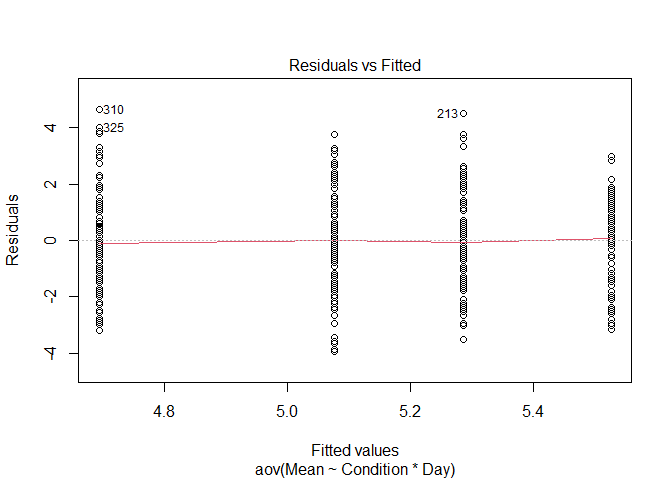<!-- -->

```r
# NORMALITY
aov_residuals <- residuals (object=res.aov2)
shapiro.test(x=aov_residuals) #  
```

```
## 
## 	Shapiro-Wilk normality test
## 
## data:  aov_residuals
## W = 0.99501, p-value = 0.2453
```

```r
# VAS %>%
#   group_by(Condition, Day) %>%
#   shapiro.test(Mean) # 
#visualisation
plot(res.aov2, 2) #normal
```

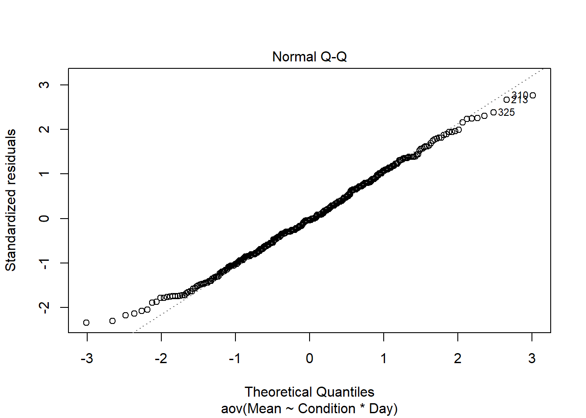<!-- -->

```r
ggqqplot(VAS, "Mean", ggtheme = theme_bw()) +
  facet_grid(Day ~ Condition)
```

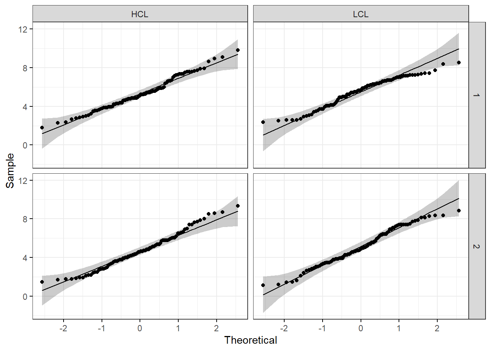<!-- -->

```r
ggqqplot(VAS, "Mean", ggtheme = theme_bw()) +
  facet_grid( ~Condition) #  very obviously NOT a normal distribution
```

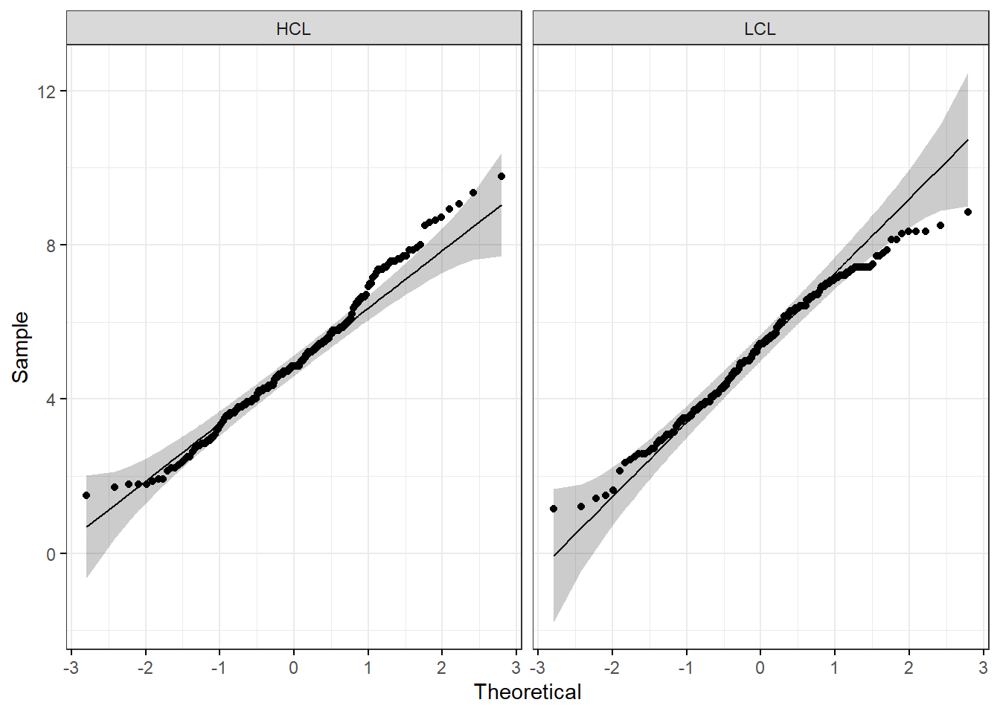<!-- -->

```r
# SPHERICITY: Mauchly's test
x<-anova_test(data= VAS, dv= Mean, wid= ID, between= Condition, within= c(Time, Day))
get_anova_table(x, correction = c('GG')) #variances are NOT equal! 
```

```
## ANOVA Table (type III tests)
## 
##               Effect DFn DFd      F        p p<.05      ges
## 1          Condition   1  95  1.152 2.86e-01       9.00e-03
## 2               Time   1  95 26.486 1.43e-06     * 1.30e-02
## 3                Day   1  95 10.908 1.00e-03     * 2.40e-02
## 4     Condition:Time   1  95  0.064 8.01e-01       3.12e-05
## 5      Condition:Day   1  95  0.206 6.51e-01       4.61e-04
## 6           Time:Day   1  95  0.122 7.28e-01       2.86e-05
## 7 Condition:Time:Day   1  95  0.094 7.60e-01       2.20e-05
```

```r
x$'Sphericity Corrections'
```

```
## NULL
```

```r
# OUTLIERS
summary(VAS$Mean)
```

```
##    Min. 1st Qu.  Median    Mean 3rd Qu.    Max. 
##   1.143   3.929   5.071   5.148   6.429   9.786
```

```r
outliers <- boxplot(VAS$Mean, plot=FALSE)$out
#visualise
d<-melt(data.frame(VAS=c(VAS$Mean))) # we melt to wide format
distribution_plot (d, 'Mean')
```

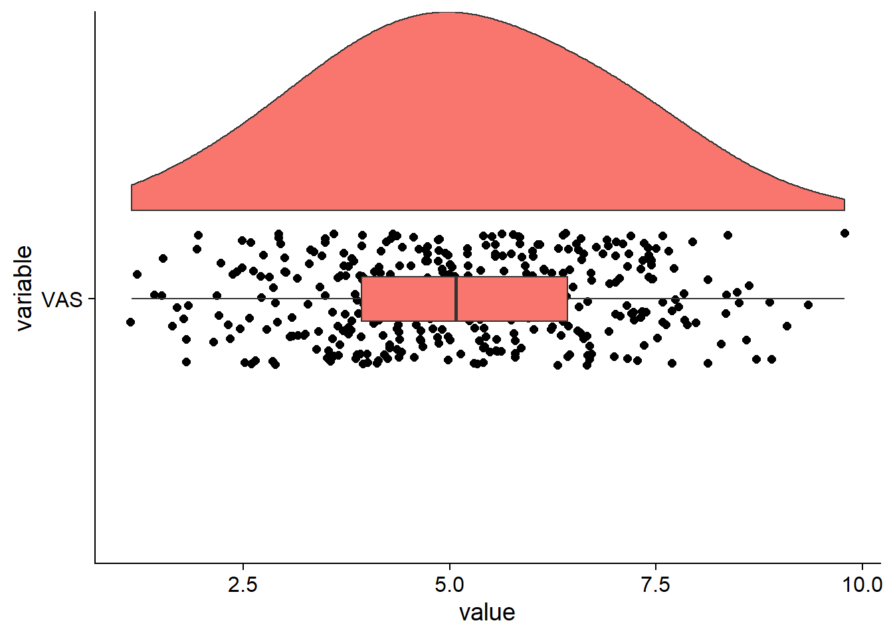<!-- -->

```r
qqPlot(VAS$Mean) 
```

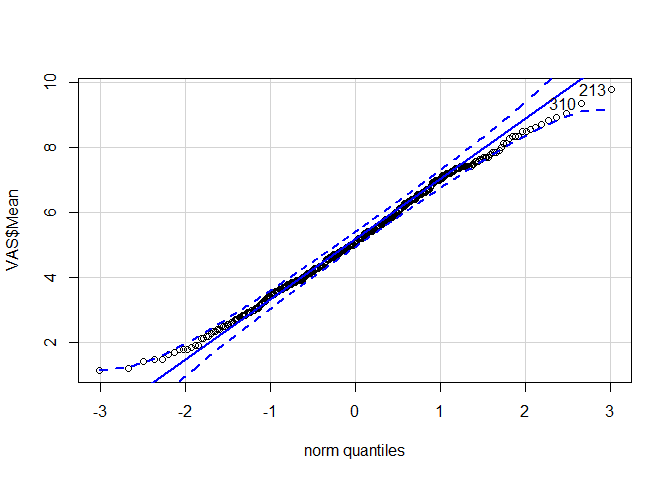<!-- -->

```
## [1] 213 310
```

```r
#### repeated-measures ANOVA ####
get_anova_table(x)
```

```
## ANOVA Table (type III tests)
## 
##               Effect DFn DFd      F        p p<.05      ges
## 1          Condition   1  95  1.152 2.86e-01       9.00e-03
## 2               Time   1  95 26.486 1.43e-06     * 1.30e-02
## 3                Day   1  95 10.908 1.00e-03     * 2.40e-02
## 4     Condition:Time   1  95  0.064 8.01e-01       3.12e-05
## 5      Condition:Day   1  95  0.206 6.51e-01       4.61e-04
## 6           Time:Day   1  95  0.122 7.28e-01       2.86e-05
## 7 Condition:Time:Day   1  95  0.094 7.60e-01       2.20e-05
```

```r
#tukey's post-hoc analyses: see if performance decreased faster in HCL compared to LCL
two_w <- lm(Mean ~ Time*Condition, data= VAS)
exp.av <- aov(two_w)
summary(exp.av)
```

```
##                 Df Sum Sq Mean Sq F value Pr(>F)  
## Time             1   14.0  13.950   4.843 0.0283 *
## Condition        1    9.4   9.406   3.266 0.0715 .
## Time:Condition   1    0.0   0.034   0.012 0.9139  
## Residuals      384 1106.0   2.880                 
## ---
## Signif. codes:  0 '***' 0.001 '**' 0.01 '*' 0.05 '.' 0.1 ' ' 1
```

```r
tukey.test <- TukeyHSD(exp.av)
tukey.test$Time 
```

```
##          diff        lwr       upr      p adj
## 2-1 0.3792342 0.04042692 0.7180414 0.02834725
```

```r
emmeans1<- emmeans(two_w, pairwise ~ Time*Condition, adjust ="fdr", type = "response")
emmean_dataframe <- summary(emmeans1)$emmeans
Anova(two_w, type='III')
```

```
## Anova Table (Type III tests)
## 
## Response: Mean
##                 Sum Sq  Df  F value Pr(>F)    
## (Intercept)    2204.17   1 765.2537 <2e-16 ***
## Time              7.61   1   2.6407 0.1050    
## Condition         5.28   1   1.8341 0.1764    
## Time:Condition    0.03   1   0.0117 0.9139    
## Residuals      1106.04 384                    
## ---
## Signif. codes:  0 '***' 0.001 '**' 0.01 '*' 0.05 '.' 0.1 ' ' 1
```

```r
summary(emmeans1)
```

```
## $emmeans
##  Time Condition emmean    SE  df lower.CL upper.CL
##  1    HCL         4.79 0.173 384     4.45     5.13
##  2    HCL         5.19 0.173 384     4.85     5.53
##  1    LCL         5.12 0.171 384     4.78     5.46
##  2    LCL         5.48 0.171 384     5.15     5.82
## 
## Confidence level used: 0.95 
## 
## $contrasts
##  contrast      estimate    SE  df t.ratio p.value
##  1 HCL - 2 HCL   -0.398 0.245 384  -1.625  0.2647
##  1 HCL - 1 LCL   -0.330 0.244 384  -1.354  0.2647
##  1 HCL - 2 LCL   -0.691 0.244 384  -2.835  0.0290
##  2 HCL - 1 LCL    0.068 0.244 384   0.279  0.7803
##  2 HCL - 2 LCL   -0.293 0.244 384  -1.201  0.2764
##  1 LCL - 2 LCL   -0.361 0.242 384  -1.488  0.2647
## 
## P value adjustment: fdr method for 6 tests
```

```r
three_w <- lm(Mean ~ Time*Condition*Day, data= VAS)
exp.av <- aov(three_w)
summary(exp.av)
```

```
##                     Df Sum Sq Mean Sq F value  Pr(>F)   
## Time                 1   14.0  13.950   4.912 0.02726 * 
## Condition            1    9.4   9.406   3.312 0.06956 . 
## Day                  1   26.3  26.291   9.258 0.00251 **
## Time:Condition       1    0.0   0.034   0.012 0.91332   
## Time:Day             1    0.0   0.030   0.011 0.91779   
## Condition:Day        1    0.5   0.498   0.175 0.67566   
## Time:Condition:Day   1    0.0   0.024   0.008 0.92719   
## Residuals          380 1079.2   2.840                   
## ---
## Signif. codes:  0 '***' 0.001 '**' 0.01 '*' 0.05 '.' 0.1 ' ' 1
```

```r
tukey.test <- TukeyHSD(exp.av)
tukey.test$Time #t1 > t4 & t5, t2 >t4 & t5!
```

```
##          diff        lwr       upr      p adj
## 2-1 0.3792342 0.04279553 0.7156728 0.02726035
```

```r
emmeans1<- emmeans(three_w, pairwise ~ Time*Condition*Day, adjust ="fdr", type = "response")
emmean_dataframe <- summary(emmeans1)$emmeans
Anova(three_w, type='III')
```

```
## Anova Table (Type III tests)
## 
## Response: Mean
##                     Sum Sq  Df  F value Pr(>F)    
## (Intercept)        1234.53   1 434.6958 <2e-16 ***
## Time                  4.47   1   1.5738 0.2104    
## Condition             1.82   1   0.6412 0.4238    
## Day                   7.51   1   2.6456 0.1047    
## Time:Condition        0.06   1   0.0201 0.8874    
## Time:Day              0.05   1   0.0189 0.8906    
## Condition:Day         0.15   1   0.0536 0.8171    
## Time:Condition:Day    0.02   1   0.0084 0.9272    
## Residuals          1079.20 380                    
## ---
## Signif. codes:  0 '***' 0.001 '**' 0.01 '*' 0.05 '.' 0.1 ' ' 1
```

```r
summary(emmeans1)
```

```
## $emmeans
##  Time Condition Day emmean    SE  df lower.CL upper.CL
##  1    HCL       1     5.07 0.243 380     4.59     5.55
##  2    HCL       1     5.50 0.243 380     5.02     5.98
##  1    LCL       1     5.35 0.241 380     4.87     5.82
##  2    LCL       1     5.71 0.241 380     5.24     6.18
##  1    HCL       2     4.51 0.243 380     4.03     4.99
##  2    HCL       2     4.88 0.243 380     4.40     5.35
##  1    LCL       2     4.90 0.241 380     4.42     5.37
##  2    LCL       2     5.26 0.241 380     4.78     5.73
## 
## Confidence level used: 0.95 
## 
## $contrasts
##  contrast          estimate    SE  df t.ratio p.value
##  1 HCL 1 - 2 HCL 1  -0.4315 0.344 380  -1.255  0.4209
##  1 HCL 1 - 1 LCL 1  -0.2741 0.342 380  -0.801  0.5933
##  1 HCL 1 - 2 LCL 1  -0.6370 0.342 380  -1.861  0.2423
##  1 HCL 1 - 1 HCL 2   0.5595 0.344 380   1.627  0.2931
##  1 HCL 1 - 2 HCL 2   0.1949 0.344 380   0.567  0.6860
##  1 HCL 1 - 1 LCL 2   0.1735 0.342 380   0.507  0.6860
##  1 HCL 1 - 2 LCL 2  -0.1851 0.342 380  -0.541  0.6860
##  2 HCL 1 - 1 LCL 1   0.1575 0.342 380   0.460  0.6953
##  2 HCL 1 - 2 LCL 1  -0.2055 0.342 380  -0.600  0.6860
##  2 HCL 1 - 1 HCL 2   0.9911 0.344 380   2.881  0.0586
##  2 HCL 1 - 2 HCL 2   0.6265 0.344 380   1.821  0.2423
##  2 HCL 1 - 1 LCL 2   0.6050 0.342 380   1.768  0.2423
##  2 HCL 1 - 2 LCL 2   0.2464 0.342 380   0.720  0.6293
##  1 LCL 1 - 2 LCL 1  -0.3630 0.340 380  -1.066  0.4316
##  1 LCL 1 - 1 HCL 2   0.8336 0.342 380   2.436  0.0996
##  1 LCL 1 - 2 HCL 2   0.4690 0.342 380   1.370  0.4081
##  1 LCL 1 - 1 LCL 2   0.4475 0.340 380   1.314  0.4081
##  1 LCL 1 - 2 LCL 2   0.0889 0.340 380   0.261  0.8235
##  2 LCL 1 - 1 HCL 2   1.1966 0.342 380   3.496  0.0148
##  2 LCL 1 - 2 HCL 2   0.8320 0.342 380   2.431  0.0996
##  2 LCL 1 - 1 LCL 2   0.8105 0.340 380   2.381  0.0996
##  2 LCL 1 - 2 LCL 2   0.4519 0.340 380   1.327  0.4081
##  1 HCL 2 - 2 HCL 2  -0.3646 0.344 380  -1.060  0.4316
##  1 HCL 2 - 1 LCL 2  -0.3861 0.342 380  -1.128  0.4316
##  1 HCL 2 - 2 LCL 2  -0.7447 0.342 380  -2.176  0.1408
##  2 HCL 2 - 1 LCL 2  -0.0215 0.342 380  -0.063  0.9500
##  2 HCL 2 - 2 LCL 2  -0.3801 0.342 380  -1.111  0.4316
##  1 LCL 2 - 2 LCL 2  -0.3586 0.340 380  -1.053  0.4316
## 
## P value adjustment: fdr method for 28 tests
```

```r
#summary 
sum <- sum_3 (VAS, 'Time', 'Condition', 'Day', 'Mean')
sum
```

```
## # A tibble: 8 x 8
## # Groups:   Time, Condition [4]
##   Time  Condition Day       n  mean    sd    se    ic
##   <fct> <fct>     <fct> <int> <dbl> <dbl> <dbl> <dbl>
## 1 1     HCL       1        48  5.07  1.43 0.207 0.417
## 2 1     HCL       2        48  4.51  1.60 0.231 0.465
## 3 1     LCL       1        49  5.35  1.38 0.197 0.396
## 4 1     LCL       2        49  4.90  1.70 0.243 0.488
## 5 2     HCL       1        48  5.50  1.81 0.261 0.526
## 6 2     HCL       2        48  4.88  1.93 0.279 0.562
## 7 2     LCL       1        49  5.71  1.55 0.221 0.444
## 8 2     LCL       2        49  5.26  1.98 0.282 0.568
```

```r
## VISUALISATION
# boxplot 
bxp <- ggboxplot(
  VAS, x = "Condition", y = "Mean",
  color = "Time", palette = "jco",
  facet.by = "Day", short.panel.labs = FALSE
  )
## plot with error bars
pl <- plotty(VAS, emmean_dataframe, 'Time', 'Mean', 'Condition', 'emmean', 'subj CF') +
 facet_grid(.~Day)+
scale_x_discrete(labels=c("Before", "After"))
ggsave(pl, file=paste0(plotPrefix, "VAS_Plot.jpg"), width = 2500, height = 1500, dpi = 300, units = "px")
pl
```

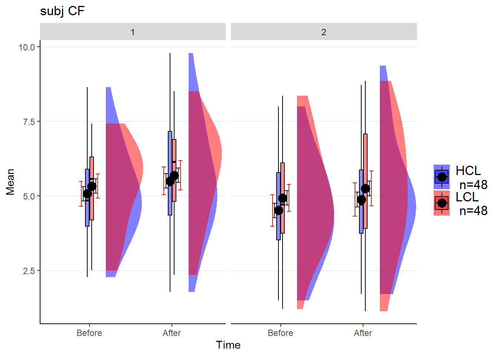<!-- -->

```r
# 
# # difference score, devide by baseline (pre TloadBack) as a function of group (Day/condition): (2-1)/1
# for (i in 1:97) {
#   VAS$Diff[VAS$ID==i & VAS$Day==1] = 
#     ((VAS$Mean[VAS$Test==2 & VAS$ID==i & VAS$Day==1]- VAS$Mean[VAS$Test==1 & VAS$ID==i & VAS$Day==1])/VAS$Mean[VAS$Test==1 & VAS$ID==i & VAS$Day==1])
#   VAS$Diff[VAS$ID==i & VAS$Day==2] = 
#     ((VAS$Mean[VAS$Test==2 & VAS$ID==i & VAS$Day==1]- VAS$Mean[VAS$Test==1 & VAS$ID==i & VAS$Day==2])/VAS$Mean[VAS$Test==1 & VAS$ID==i & VAS$Day==2])
# }
# ### CHECKING ASSUMPTIONS ####
# # Time x Condition 2-way ANOVA with interaction effect (what Borrogan did)
# res.aov2 <- aov(Diff ~ Condition * Day, data= VAS)
# summary(res.aov2)
# # HOMOGENEITY OF VARIANCE
# plot(res.aov2, 1) # residuqls vs fits plot shows no evident relationship residuals and fitted values (Diffs of groups)
# 
# # NORMALITY
# aov_residuals <- residuals (object=res.aov2)
# shapiro.test(x=aov_residuals) #  
# VAS %>%
#   group_by(Condition, Day) %>%
#   shapiro_test(Diff) # 
# #visualisation
# plot(res.aov2, 2) #normal
# ggqqplot(VAS, "Diff", ggtheme = theme_bw()) +
#   facet_grid(Day ~ Condition)
# ggqqplot(VAS, "Diff", ggtheme = theme_bw()) +
#   facet_grid( ~Condition) #  very obviously NOT a normal distribution
# 
# # SPHERICITY: Mauchly's test
# x<-anova_test(data= VAS, dv= Diff, wid= ID, between= Condition, within= c(Time, Day))
# get_anova_table(x, correction = c('GG')) #variances are NOT equal! 
# x$'Sphericity Corrections'
# 
# # OUTLIERS
# summary(VAS$Diff)
# outliers <- boxplot(VAS$Diff, plot=FALSE)$out
# # remove 
#  VAS<- VAS[-which(VAS$Diff %in% outliers),]
# #visualise
# d<-melt(data.frame(VAS=c(VAS$Diff))) # we melt to wide format
# distribution_plot (d, 'Diff')
# qqPlot(VAS$Diff) 
# 
# 
# #### repeated-measures ANOVA ####
# x<-anova_test(data= VAS, dv= Diff, wid= ID, between= Condition, within= c(Time, Day))
# get_anova_table(x)
# 
# #tukey's post-hoc analyses: see if performance decreased faster in HCL compared to LCL
# two_w <- lm(Diff ~ Time*Condition, data= VAS)
# exp.av <- aov(two_w)
# summary(exp.av)
# tukey.test <- TukeyHSD(exp.av)
# tukey.test$Time 
# emmeans1<- emmeans(two_w, pairwise ~ Time*Condition, adjust ="fdr", type = "response")
# emDiff_dataframe <- summary(emmeans1)$emmeans
# Anova(two_w, type='III')
# summary(emmeans1)
# 
# #summary 
# sum <- sum_3 (VAS, 'Time', 'Condition', 'Day', 'Diff')
# sum
# 
# ## VISUALISATION
# # boxplot 
# bxp <- ggboxplot(
#   VAS, x = "Condition", y = "Diff",
#   color = "Time", palette = "jco",
#   facet.by = "Day", short.panel.labs = FALSE
#   )
# ## plot with error bars
# pl <- plotty(VAS, emmean_dataframe, 'Day', 'Diff', 'Condition', 'emmean', 'subj CF')
# scale_x_discrete(labels=c("Before", "After"))
```

-----------------------------------------------------------------------------------

## Objective CF

* We will test  the evolution of Performance (weighted accuracy) during TloadDback with Condition (HCL/LCL) and Time (t1-t3) as within-subject factors.
* interested in main effect e.g. t1>t4 and Condition x Time interaction on the Acc


```r
##########################################
  ### PERFORMANCE/ ACCURACY/ OBJECTIVE CF ###
#########################################

#### DOWNLOAD + CLEAN DATA ####
data<- read.csv(paste0(Dir, "EXP.csv"), header = TRUE, sep = )
# we remove rows that have prop_correct == NA , because these are lines in the data where the ERROR message was shown (accuracy=0)
data <- data[!is.na(data$prop_correct),]
# create a trial.index that goes from 1 to the number of trials:  not every participant has equal amount of trials, depends on their speed/accuracy
for (i in 1:97) { data$trial.index[data$ID==i]= 1:length(unique(data$Trial.Index[data$ID ==i]))}

# length(data$trial.index[is.na(data$trial.index)]) 
# data = subset(data, select = -c(Local.Date, Participant.Private.ID, Task.Name, Accuracy_Level, Time.Elapsed, Trial.Index))

# create var Time that indicates if it is part of t1, t2, t3. t1 is the first 40%, t2 middle 20%, t3 last 40% 
# we work with percentages because the #trials differs per ptt AND per day: 
for (i in 1:97) {
  data$Time[data$ID ==i & data$Day==1] = 2 # day 1
  data$Time[data$ID ==i & data$Day==1 & data$trial.index<(0.6* length(data$trial.index[data$Day==1 & data$ID==i])) ] = "middle"
  data$Time[data$ID ==i & data$Day==1 & data$trial.index<(0.4* length(data$trial.index[data$Day==1 & data$ID==i])) ] = 1
  data$Time[data$ID ==i & data$Day==2] = 2 # day 2
  data$Time[data$ID ==i & data$Day==2 & data$trial.index<(0.6* length(data$trial.index[data$Day==2 & data$ID==i])) ] = "middle"
  data$Time[data$ID ==i & data$Day==2 & data$trial.index<(0.4* length(data$trial.index[data$Day==2 & data$ID==i])) ] = 1
}
#remove 'middle'
data <- data[!(data$Time=="middle"),]
# CREATE DATAFRAME, with the Mean prop_correct per ID, Time, Day, Condition
EXP <- as.data.frame (group_by(data, Condition, Day, Time, ID) %>%
  summarise(
    count = n(),
    Mean = mean(prop_correct, na.rm = TRUE)
  ))
head(EXP) # mean Mean (prop_correct) per ID, Time, Day and Condition
```

```
##   Condition Day Time ID count      Mean
## 1       HCL   1    1 50   179 0.7368638
## 2       HCL   1    1 51   108 0.7615934
## 3       HCL   1    1 52   127 0.6388012
## 4       HCL   1    1 53   102 0.5617524
## 5       HCL   1    1 54    95 0.6043328
## 6       HCL   1    1 55   121 0.6698068
```

```r
# set factors
EXP$Time <- as.factor(EXP$Time)
EXP$Condition <- as.factor(EXP$Condition)
EXP$Day <- as.factor(EXP$Day)
EXP$ID <- as.factor(EXP$ID)


### CHECKING ASSUMPTIONS ####

# Time x Condition 2-way ANOVA with interaction effect
res.aov2 <- aov(Mean ~ Condition*Time, data= EXP)
summary(res.aov2)
```

```
##                 Df Sum Sq Mean Sq F value   Pr(>F)    
## Condition        1  5.986   5.986  387.32  < 2e-16 ***
## Time             1  0.188   0.188   12.20 0.000534 ***
## Condition:Time   1  0.068   0.068    4.41 0.036380 *  
## Residuals      384  5.935   0.015                     
## ---
## Signif. codes:  0 '***' 0.001 '**' 0.01 '*' 0.05 '.' 0.1 ' ' 1
```

```r
## HOMOGENEITY OF VARIANCE
#Levene's test homogeneity variances
leveneTest(Mean~ Time * Condition, data= EXP) # no homogeneity! problem! 
```

```
## Levene's Test for Homogeneity of Variance (center = median)
##        Df F value  Pr(>F)  
## group   3  2.5902 0.05256 .
##       384                  
## ---
## Signif. codes:  0 '***' 0.001 '**' 0.01 '*' 0.05 '.' 0.1 ' ' 1
```

```r
box_m(EXP[, 'Mean', drop=FALSE], EXP$Condition) # no homogeneity of variance
```

```
## # A tibble: 1 x 4
##   statistic  p.value parameter method                                           
##       <dbl>    <dbl>     <dbl> <chr>                                            
## 1      48.0 4.18e-12         1 Box's M-test for Homogeneity of Covariance Matri~
```

```r
#visualisation
plot(res.aov2, 1) # residuqls vs fits plot shows no evident relationship residuals and fitted values (means of groups)
```

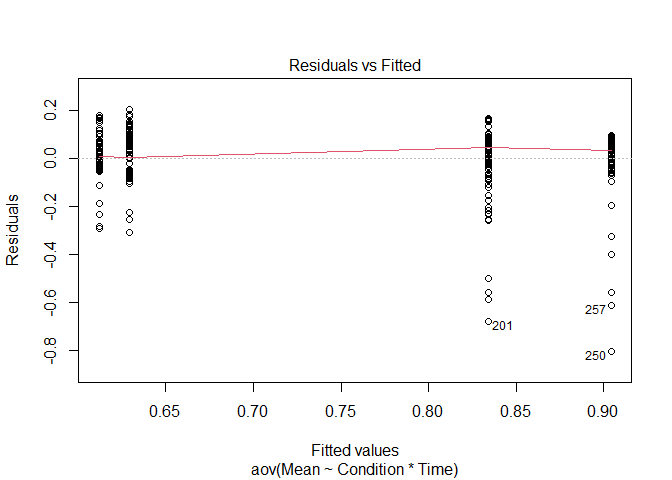<!-- -->

```r
## NORMALITY
aov_residuals <- residuals (object=res.aov2)
shapiro.test(x=aov_residuals) # no normality! 
```

```
## 
## 	Shapiro-Wilk normality test
## 
## data:  aov_residuals
## W = 0.78526, p-value < 2.2e-16
```

```r
# EXP %>%
#   group_by(Condition, Time) %>%
#   shapiro.test(Mean) # no normal distribution!
#visualisation
plot(res.aov2, 2) #clearly not normal
```

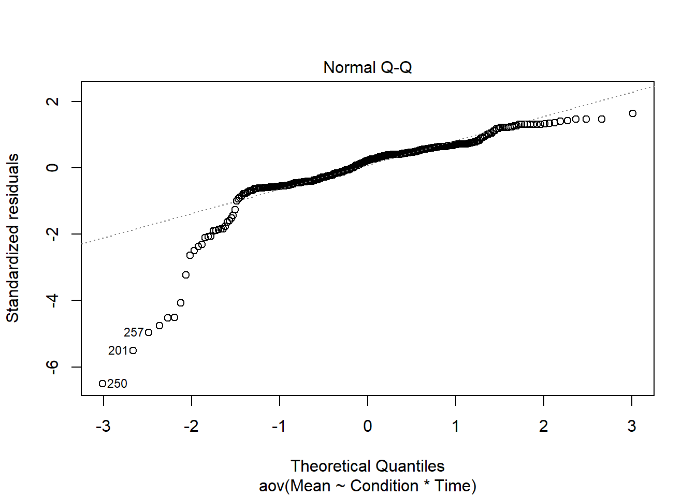<!-- -->

```r
ggqqplot(EXP, "Mean", ggtheme = theme_bw()) +
  facet_grid(Time ~ Condition)
```

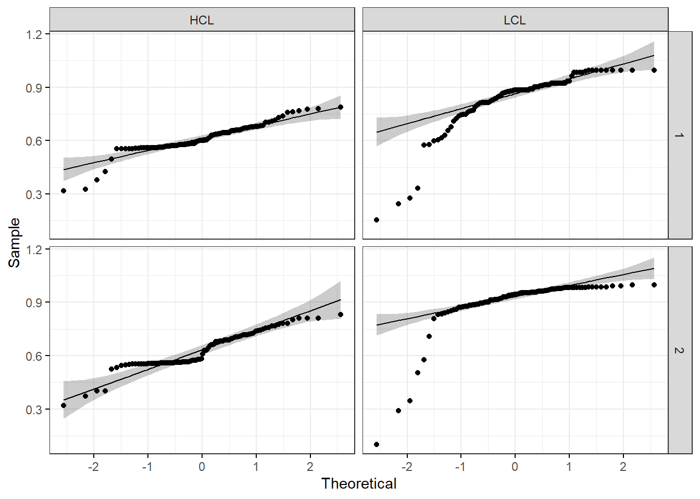<!-- -->

```r
ggqqplot(EXP, "Mean", ggtheme = theme_bw()) +
  facet_grid( ~Condition) #  very obviously NOT a normal distribution
```

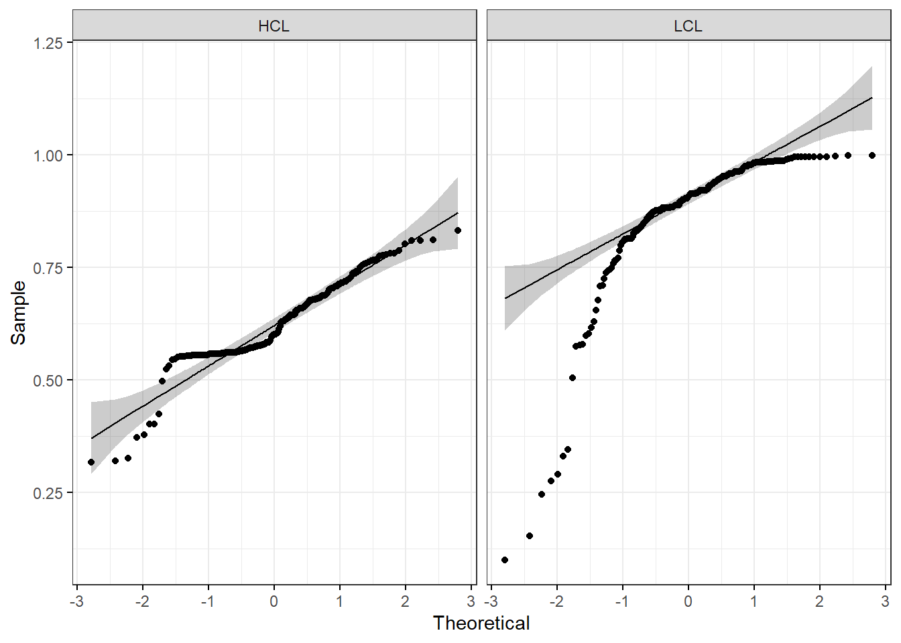<!-- -->

```r
## SPHERICITY: Mauchly's test
x<-anova_test(data= EXP, dv= Mean, wid= ID, between= Condition, within= c(Time, Day))
get_anova_table(x, correction = c('GG')) #variances are NOT equal! 
```

```
## ANOVA Table (type III tests)
## 
##               Effect DFn DFd       F        p p<.05   ges
## 1          Condition   1  95 162.886 2.56e-22     * 0.539
## 2               Time   1  95  93.602 8.19e-16     * 0.035
## 3                Day   1  95  24.982 2.64e-06     * 0.057
## 4     Condition:Time   1  95  34.272 6.82e-08     * 0.013
## 5      Condition:Day   1  95   2.729 1.02e-01       0.007
## 6           Time:Day   1  95  19.077 3.20e-05     * 0.010
## 7 Condition:Time:Day   1  95 158.069 6.30e-22     * 0.076
```

```r
x$'Sphericity Corrections'
```

```
## NULL
```

```r
## OUTLIERS
EXP %>%
  group_by(Condition, Time) %>%
  identify_outliers(Mean)
```

```
## # A tibble: 21 x 8
##    Condition Time  Day   ID    count  Mean is.outlier is.extreme
##    <fct>     <fct> <fct> <fct> <int> <dbl> <lgl>      <lgl>     
##  1 HCL       1     1     63       44 0.326 TRUE       FALSE     
##  2 HCL       1     1     95       44 0.318 TRUE       FALSE     
##  3 HCL       1     2     63       44 0.425 TRUE       FALSE     
##  4 HCL       1     2     95       44 0.378 TRUE       FALSE     
##  5 HCL       2     2     95       52 0.320 TRUE       FALSE     
##  6 LCL       1     1     4        44 0.574 TRUE       FALSE     
##  7 LCL       1     1     9        44 0.153 TRUE       TRUE      
##  8 LCL       1     1     16       44 0.245 TRUE       TRUE      
##  9 LCL       1     1     20       44 0.598 TRUE       FALSE     
## 10 LCL       1     1     27       44 0.630 TRUE       FALSE     
## # ... with 11 more rows
```

```r
 outliers <- boxplot(EXP$prop_correct, plot=FALSE)$out
summary(EXP$Mean)
```

```
##    Min. 1st Qu.  Median    Mean 3rd Qu.    Max. 
##  0.0992  0.5827  0.7432  0.7460  0.9092  0.9985
```

```r
#remove under e.g. 3? (sign not paying attention? a bit arbitrary)
#EXP <-  EXP[!EXP$Mean<0.3,]
#remove outliers per condition (HCL/LCL) because they have different distributions! 
list_quantiles <- tapply(EXP$Mean, EXP$Condition, quantile)
Q1s <- sapply(1:2, function(i) list_quantiles[[i]][2])
Q3s <- sapply(1:2, function(i) list_quantiles[[i]][4])
IQRs <- tapply(EXP$Mean, EXP$Condition, IQR)
Lowers <- Q1s - 1.5*IQRs
Uppers <- Q3s + 1.5*IQRs
datas <- split(EXP, EXP$Condition)
data_no_outlier <- NULL
for (i in 1:2){
  out <- subset(datas[[i]], datas[[i]]$Mean > Lowers[i] & datas[[i]]$Mean < Uppers[i])
  data_no_outlier <- rbind(data_no_outlier, out)}
EXP<- as.data.frame(data_no_outlier)
#even after log transform and removing outliers we have clearly not a normal distribution 
# so we need to use GLM. https://stats.stackexchange.com/questions/189115/fitting-a-binomial-glmm-glmer-to-a-response-variable-that-is-a-proportion-or-f

### CONDITION * TIME ###
# HCLvs LCL over time
#BINOMIAL because the Mean accuracy is between 0 and 1
# it is a (continuous) proportion: we need to use the 'weights' argument for the number of trials that lead to the proportion
two_w <- glmer(Mean ~ Condition * Time + (1 | ID), weights = count,
   family = binomial, data = EXP)
emmeans1<- emmeans(two_w, pairwise ~ Condition * Time, adjust ="fdr", type = "response")
emmean_dataframe <- summary(emmeans1)$emmeans
Anova(two_w, type='III')
```

```
## Analysis of Deviance Table (Type III Wald chisquare tests)
## 
## Response: Mean
##                  Chisq Df Pr(>Chisq)    
## (Intercept)    113.856  1  < 2.2e-16 ***
## Condition      397.170  1  < 2.2e-16 ***
## Time            17.230  1  3.313e-05 ***
## Condition:Time  39.759  1  2.873e-10 ***
## ---
## Signif. codes:  0 '***' 0.001 '**' 0.01 '*' 0.05 '.' 0.1 ' ' 1
```

```r
summary(emmeans1)
```

```
## $emmeans
##  Condition Time  prob      SE  df asymp.LCL asymp.UCL
##  HCL       1    0.617 0.01057 Inf     0.596     0.638
##  LCL       1    0.886 0.00655 Inf     0.872     0.898
##  HCL       2    0.642 0.01024 Inf     0.622     0.662
##  LCL       2    0.936 0.00445 Inf     0.927     0.944
## 
## Confidence level used: 0.95 
## Intervals are back-transformed from the logit scale 
## 
## $contrasts
##  contrast      odds.ratio      SE  df null z.ratio p.value
##  HCL 1 / LCL 1      0.208 0.01638 Inf    1 -19.929  <.0001
##  HCL 1 / HCL 2      0.898 0.02333 Inf    1  -4.151  <.0001
##  HCL 1 / LCL 2      0.110 0.00957 Inf    1 -25.317  <.0001
##  LCL 1 / HCL 2      4.326 0.34085 Inf    1  18.585  <.0001
##  LCL 1 / LCL 2      0.528 0.04227 Inf    1  -7.975  <.0001
##  HCL 2 / LCL 2      0.122 0.01065 Inf    1 -24.112  <.0001
## 
## P value adjustment: fdr method for 6 tests 
## Tests are performed on the log odds ratio scale
```

```r
#summary 
sum <- sum_2 (EXP, 'Time', 'Condition', 'Mean')
sum
```

```
## # A tibble: 4 x 7
## # Groups:   Time [2]
##   Time  Condition     n  mean     sd      se     ic
##   <fct> <fct>     <int> <dbl>  <dbl>   <dbl>  <dbl>
## 1 1     HCL          93 0.621 0.0665 0.00690 0.0137
## 2 1     LCL          86 0.881 0.0734 0.00791 0.0157
## 3 2     HCL          94 0.635 0.0926 0.00955 0.0190
## 4 2     LCL          93 0.933 0.0513 0.00532 0.0106
```

```r
## VISUALISATION
# boxplot 
bxp <- ggboxplot(
  EXP, x = "Time", y = "Mean",
  color = "Condition", palette = "jco")
bxp
```

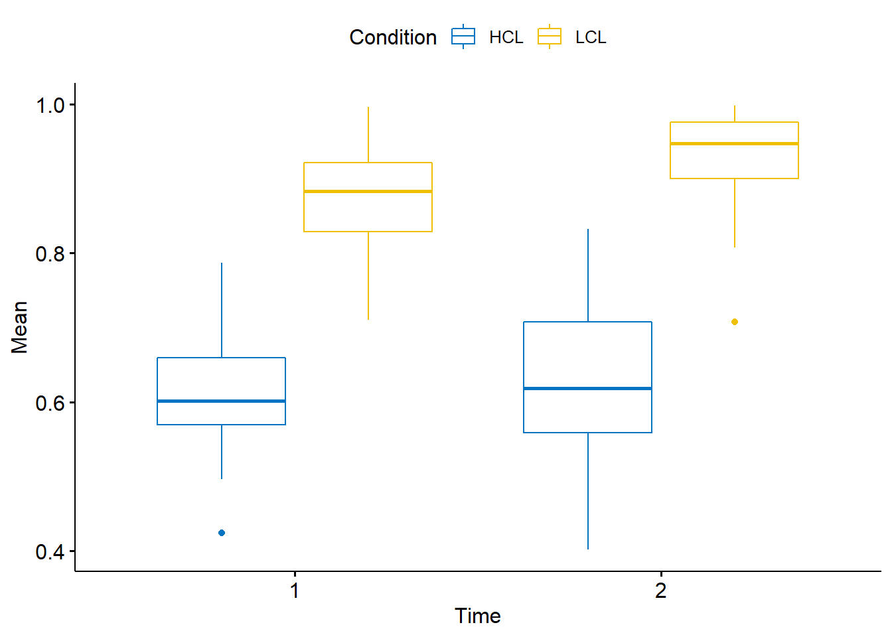<!-- -->

```r
max_y<-max(EXP$Mean)
pl <- plotty(EXP, emmean_dataframe, 'Time',  'Mean', 'Condition', 'prob', 'Performance/Objective CF') 
  #   geom_segment(aes(x =0.9, y = max_y+max_y/15, xend = 1.1, yend = max_y+max_y/15), size= 1)+ # top line
  # annotate('text', x=1, y=max_y+max_y/15+max_y/100, label='**', size=7)+ # tar
  #   geom_segment(aes(x =1.9, y = max_y+max_y/15, xend = 2.1, yend = max_y+max_y/15), size= 1) # top line
  # # annotate('text', x=2, y=max_y+max_y/15+max_y/100, label='*', size=7) # star
ggsave(pl, file=paste0(plotPrefix, "Acc_Cond_Time_Plot.jpg"), width = 2500, height = 1500, dpi = 300, units = "px")
pl
```

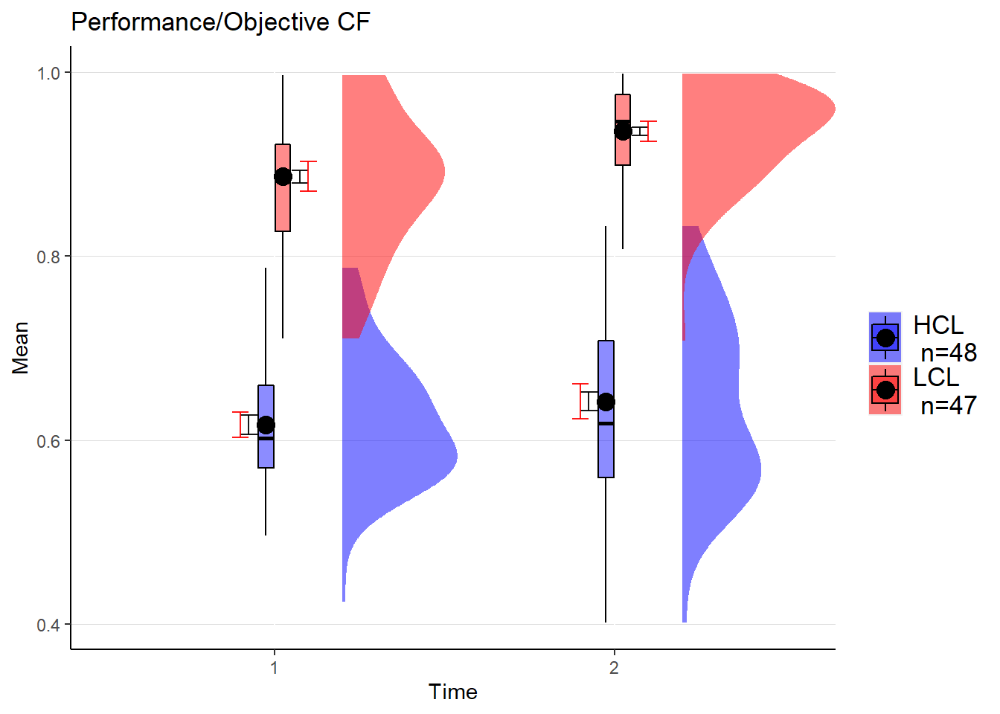<!-- -->

```r
### CONDITION ###
one_w <- glmer(Mean ~ Condition  + (1 | ID), weights = count,
   family = binomial, data = EXP)
emmeans1<- emmeans(one_w, pairwise ~ Condition, adjust ="fdr", type = "response")
emmean_dataframe <- summary(emmeans1)$emmeans

Anova(one_w, type='III')
```

```
## Analysis of Deviance Table (Type III Wald chisquare tests)
## 
## Response: Mean
##              Chisq Df Pr(>Chisq)    
## (Intercept) 169.27  1  < 2.2e-16 ***
## Condition   685.42  1  < 2.2e-16 ***
## ---
## Signif. codes:  0 '***' 0.001 '**' 0.01 '*' 0.05 '.' 0.1 ' ' 1
```

```r
summary(emmeans1)# LCL clearly has higher Mean: 0.89 for LCL and 0.62 for HCL
```

```
## $emmeans
##  Condition  prob      SE  df asymp.LCL asymp.UCL
##  HCL       0.630 0.00955 Inf     0.611     0.649
##  LCL       0.912 0.00443 Inf     0.903     0.920
## 
## Confidence level used: 0.95 
## Intervals are back-transformed from the logit scale 
## 
## $contrasts
##  contrast  odds.ratio     SE  df null z.ratio p.value
##  HCL / LCL      0.164 0.0113 Inf    1 -26.180  <.0001
## 
## Tests are performed on the log odds ratio scale
```

```r
##VISUALISATION
# boxplot 
bxp <- ggboxplot(
  EXP, x = "Condition", y = "Mean", palette = "jco")
bxp
```

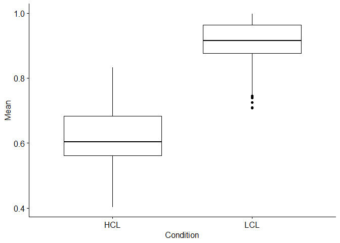<!-- -->

```r
#  plot
pl <- one_w_plot(EXP, emmean_dataframe, 'Condition', 'Mean', 'prob', 'Performance/Objective CF')
ggsave(pl, file=paste0(plotPrefix, "Acc_Cond_Plot.jpg"), width = 2500, height = 1500, dpi = 300, units = "px")
pl
```

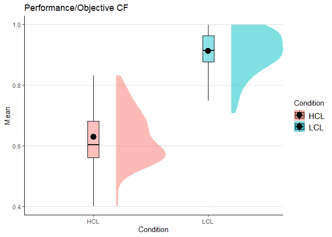<!-- -->

```r
####  DAY 1 vs DAY 2 #####
two_w <- glmer(Mean ~ Condition * Day + (1 | ID), weights = count,
   family = binomial, data = EXP)
emmeans1<- emmeans(two_w, pairwise ~ Condition * Day, adjust ="fdr", type = "response")
emmean_dataframe <- summary(emmeans1)$emmeans

Anova(two_w, type='III')
```

```
## Analysis of Deviance Table (Type III Wald chisquare tests)
## 
## Response: Mean
##                  Chisq Df Pr(>Chisq)    
## (Intercept)    93.8420  1  < 2.2e-16 ***
## Condition     458.8108  1  < 2.2e-16 ***
## Day            54.6269  1  1.457e-13 ***
## Condition:Day   5.4124  1    0.01999 *  
## ---
## Signif. codes:  0 '***' 0.001 '**' 0.01 '*' 0.05 '.' 0.1 ' ' 1
```

```r
summary(emmeans1)
```

```
## $emmeans
##  Condition Day  prob      SE  df asymp.LCL asymp.UCL
##  HCL       1   0.605 0.01053 Inf     0.584     0.626
##  LCL       1   0.895 0.00627 Inf     0.882     0.907
##  HCL       2   0.650 0.00988 Inf     0.631     0.669
##  LCL       2   0.926 0.00476 Inf     0.916     0.935
## 
## Confidence level used: 0.95 
## Intervals are back-transformed from the logit scale 
## 
## $contrasts
##  contrast      odds.ratio     SE  df null z.ratio p.value
##  HCL 1 / LCL 1      0.179 0.0144 Inf    1 -21.420  <.0001
##  HCL 1 / HCL 2      0.824 0.0216 Inf    1  -7.391  <.0001
##  HCL 1 / LCL 2      0.122 0.0101 Inf    1 -25.460  <.0001
##  LCL 1 / HCL 2      4.591 0.3666 Inf    1  19.089  <.0001
##  LCL 1 / LCL 2      0.680 0.0532 Inf    1  -4.932  <.0001
##  HCL 2 / LCL 2      0.148 0.0122 Inf    1 -23.214  <.0001
## 
## P value adjustment: fdr method for 6 tests 
## Tests are performed on the log odds ratio scale
```

```r
#summary  
sum <- sum_2 (EXP, 'Day', 'Condition', 'Mean')
sum
```

```
## # A tibble: 4 x 7
## # Groups:   Day [2]
##   Day   Condition     n  mean     sd      se     ic
##   <fct> <fct>     <int> <dbl>  <dbl>   <dbl>  <dbl>
## 1 1     HCL          94 0.608 0.0695 0.00716 0.0142
## 2 1     LCL          84 0.893 0.0731 0.00798 0.0159
## 3 2     HCL          93 0.649 0.0864 0.00896 0.0178
## 4 2     LCL          95 0.922 0.0601 0.00617 0.0123
```

```r
## VISUALISATION
# plot with error bars
pl <- plotty(EXP, emmean_dataframe, 'Day',  'Mean', 'Condition', 'prob', 'Perfromance/Objective CF') 
ggsave(pl, file=paste0(plotPrefix, "Acc_Cond_Day_Plot.jpg"), width = 2500, height = 1500, dpi = 300, units = "px")
pl
```

<!-- -->

```r
### Condition * Time * Day
three_w <- glmer(Mean ~ Condition * Time * Day + (1 | ID), weights = count,
   family = binomial, data = EXP)
emmeans1<- emmeans(three_w, pairwise ~ Condition * Time * Day, adjust ="fdr", type = "response")
emmean_dataframe <- summary(emmeans1)$emmeans
Anova(two_w, type='III')
```

```
## Analysis of Deviance Table (Type III Wald chisquare tests)
## 
## Response: Mean
##                  Chisq Df Pr(>Chisq)    
## (Intercept)    93.8420  1  < 2.2e-16 ***
## Condition     458.8108  1  < 2.2e-16 ***
## Day            54.6269  1  1.457e-13 ***
## Condition:Day   5.4124  1    0.01999 *  
## ---
## Signif. codes:  0 '***' 0.001 '**' 0.01 '*' 0.05 '.' 0.1 ' ' 1
```

```r
summary(emmeans1)
```

```
## $emmeans
##  Condition Time Day  prob      SE  df asymp.LCL asymp.UCL
##  HCL       1    1   0.650 0.01164 Inf     0.627     0.672
##  LCL       1    1   0.844 0.01066 Inf     0.822     0.864
##  HCL       2    1   0.562 0.01234 Inf     0.538     0.586
##  LCL       2    1   0.936 0.00595 Inf     0.923     0.947
##  HCL       1    2   0.592 0.01187 Inf     0.569     0.615
##  LCL       1    2   0.917 0.00670 Inf     0.903     0.929
##  HCL       2    2   0.707 0.01034 Inf     0.687     0.727
##  LCL       2    2   0.937 0.00572 Inf     0.925     0.947
## 
## Confidence level used: 0.95 
## Intervals are back-transformed from the logit scale 
## 
## $contrasts
##  contrast          odds.ratio      SE  df null z.ratio p.value
##  HCL 1 1 / LCL 1 1     0.3434 0.03284 Inf    1 -11.178  <.0001
##  HCL 1 1 / HCL 2 1     1.4428 0.05581 Inf    1   9.475  <.0001
##  HCL 1 1 / LCL 2 1     0.1270 0.01420 Inf    1 -18.461  <.0001
##  HCL 1 1 / HCL 1 2     1.2761 0.04758 Inf    1   6.538  <.0001
##  HCL 1 1 / LCL 1 2     0.1681 0.01713 Inf    1 -17.496  <.0001
##  HCL 1 1 / HCL 2 2     0.7672 0.02938 Inf    1  -6.919  <.0001
##  HCL 1 1 / LCL 2 2     0.1246 0.01367 Inf    1 -18.979  <.0001
##  LCL 1 1 / HCL 2 1     4.2014 0.39953 Inf    1  15.095  <.0001
##  LCL 1 1 / LCL 2 1     0.3698 0.04171 Inf    1  -8.819  <.0001
##  LCL 1 1 / HCL 1 2     3.7160 0.35145 Inf    1  13.879  <.0001
##  LCL 1 1 / LCL 1 2     0.4894 0.05081 Inf    1  -6.883  <.0001
##  LCL 1 1 / HCL 2 2     2.2342 0.21222 Inf    1   8.464  <.0001
##  LCL 1 1 / LCL 2 2     0.3629 0.04039 Inf    1  -9.107  <.0001
##  HCL 2 1 / LCL 2 1     0.0880 0.00979 Inf    1 -21.839  <.0001
##  HCL 2 1 / HCL 1 2     0.8845 0.03202 Inf    1  -3.391  0.0008
##  HCL 2 1 / LCL 1 2     0.1165 0.01181 Inf    1 -21.207  <.0001
##  HCL 2 1 / HCL 2 2     0.5318 0.01983 Inf    1 -16.935  <.0001
##  HCL 2 1 / LCL 2 2     0.0864 0.00943 Inf    1 -22.422  <.0001
##  LCL 2 1 / HCL 1 2    10.0494 1.11391 Inf    1  20.818  <.0001
##  LCL 2 1 / LCL 1 2     1.3236 0.15455 Inf    1   2.401  0.0170
##  LCL 2 1 / HCL 2 2     6.0422 0.67176 Inf    1  16.179  <.0001
##  LCL 2 1 / LCL 2 2     0.9814 0.12169 Inf    1  -0.151  0.8797
##  HCL 1 2 / LCL 1 2     0.1317 0.01329 Inf    1 -20.091  <.0001
##  HCL 1 2 / HCL 2 2     0.6013 0.02142 Inf    1 -14.279  <.0001
##  HCL 1 2 / LCL 2 2     0.0977 0.01062 Inf    1 -21.386  <.0001
##  LCL 1 2 / HCL 2 2     4.5650 0.46229 Inf    1  14.994  <.0001
##  LCL 1 2 / LCL 2 2     0.7415 0.08582 Inf    1  -2.584  0.0105
##  HCL 2 2 / LCL 2 2     0.1624 0.01772 Inf    1 -16.656  <.0001
## 
## P value adjustment: fdr method for 28 tests 
## Tests are performed on the log odds ratio scale
```

```r
## plot with error bars
max_y<-max(EXP$Mean)
pl <- plotty(EXP, emmean_dataframe, 'Time',  'Mean', 'Condition', 'prob', 'Performance/Objective CF') +
  facet_grid(.~Day)
  #   geom_segment(aes(x =0.9, y = max_y+max_y/15, xend = 1.1, yend = max_y+max_y/15), size= 1)+ # top line
  # annotate('text', x=1, y=max_y+max_y/15+max_y/100, label='**', size=7)+ # tar
  #   geom_segment(aes(x =1.9, y = max_y+max_y/15, xend = 2.1, yend = max_y+max_y/15), size= 1) # top line
  # # annotate('text', x=2, y=max_y+max_y/15+max_y/100, label='*', size=7) # star
ggsave(pl, file=paste0(plotPrefix, "Acc_Cond_Time_Plot.jpg"), width = 2500, height = 1500, dpi = 300, units = "px")
pl
```

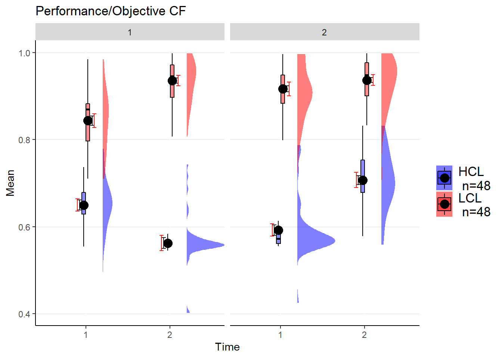<!-- -->

```r
### COMPONENTS (Color/Pic)####

# evolution over time for 2 components of the task
# Pics: decide if big/small. Color: decide if same as DualBack: more Working Memory
EXP1 <- as.data.frame (group_by(data, Condition, Day, Time, ID, Stim) %>%
  summarise(
    count = n(),
    Mean = mean(prop_correct, na.rm = TRUE)
  ))
# set factors
EXP1$Time <- as.factor(EXP1$Time)
EXP1$Condition <- as.factor(EXP1$Condition)
EXP1$Day <- as.factor(EXP1$Day)
EXP1$ID <- as.factor(EXP1$ID)
EXP1$Stim <- as.factor(EXP1$Stim)

## STATISTICAL TEST
three_w <- glmer(Mean ~ Condition * Time * Stim + (1 | ID), weights = count,
   family = binomial, data = EXP1)
emmeans1<- emmeans(three_w, pairwise ~ Condition * Time * Stim, adjust ="fdr", type = "response")
emmean_dataframe <- summary(emmeans1)$emmeans

Anova(three_w, type='III')
```

```
## Analysis of Deviance Table (Type III Wald chisquare tests)
## 
## Response: Mean
##                        Chisq Df Pr(>Chisq)    
## (Intercept)          27.5233  1  1.552e-07 ***
## Condition           107.5407  1  < 2.2e-16 ***
## Time                  8.6023  1   0.003357 ** 
## Stim                  0.1552  1   0.693569    
## Condition:Time       26.2623  1  2.981e-07 ***
## Condition:Stim        2.5317  1   0.111578    
## Time:Stim             0.0014  1   0.970086    
## Condition:Time:Stim   0.2982  1   0.585018    
## ---
## Signif. codes:  0 '***' 0.001 '**' 0.01 '*' 0.05 '.' 0.1 ' ' 1
```

```r
summary(emmeans1)
```

```
## $emmeans
##  Condition Time Stim   prob      SE  df asymp.LCL asymp.UCL
##  HCL       1    Color 0.615 0.02107 Inf     0.573     0.655
##  LCL       1    Color 0.870 0.01196 Inf     0.844     0.891
##  HCL       2    Color 0.640 0.02049 Inf     0.599     0.679
##  LCL       2    Color 0.927 0.00779 Inf     0.910     0.941
##  HCL       1    Pic   0.611 0.02113 Inf     0.569     0.652
##  LCL       1    Pic   0.850 0.01321 Inf     0.822     0.874
##  HCL       2    Pic   0.636 0.02058 Inf     0.595     0.675
##  LCL       2    Pic   0.921 0.00829 Inf     0.904     0.936
## 
## Confidence level used: 0.95 
## Intervals are back-transformed from the logit scale 
## 
## $contrasts
##  contrast                  odds.ratio     SE  df null z.ratio p.value
##  HCL 1 Color / LCL 1 Color      0.239 0.0330 Inf    1 -10.370  <.0001
##  HCL 1 Color / HCL 2 Color      0.898 0.0329 Inf    1  -2.933  0.0043
##  HCL 1 Color / LCL 2 Color      0.125 0.0182 Inf    1 -14.261  <.0001
##  HCL 1 Color / HCL 1 Pic        1.015 0.0372 Inf    1   0.394  0.6936
##  HCL 1 Color / LCL 1 Pic        0.281 0.0384 Inf    1  -9.292  <.0001
##  HCL 1 Color / HCL 2 Pic        0.913 0.0334 Inf    1  -2.486  0.0151
##  HCL 1 Color / LCL 2 Pic        0.136 0.0197 Inf    1 -13.762  <.0001
##  LCL 1 Color / HCL 2 Color      3.760 0.5190 Inf    1   9.594  <.0001
##  LCL 1 Color / LCL 2 Color      0.523 0.0517 Inf    1  -6.553  <.0001
##  LCL 1 Color / HCL 1 Pic        4.247 0.5863 Inf    1  10.476  <.0001
##  LCL 1 Color / LCL 1 Pic        1.176 0.1002 Inf    1   1.901  0.0641
##  LCL 1 Color / HCL 2 Pic        3.822 0.5275 Inf    1   9.713  <.0001
##  LCL 1 Color / LCL 2 Pic        0.569 0.0556 Inf    1  -5.769  <.0001
##  HCL 2 Color / LCL 2 Color      0.139 0.0203 Inf    1 -13.527  <.0001
##  HCL 2 Color / HCL 1 Pic        1.130 0.0413 Inf    1   3.334  0.0011
##  HCL 2 Color / LCL 1 Pic        0.313 0.0427 Inf    1  -8.507  <.0001
##  HCL 2 Color / HCL 2 Pic        1.017 0.0371 Inf    1   0.448  0.6782
##  HCL 2 Color / LCL 2 Pic        0.151 0.0219 Inf    1 -13.024  <.0001
##  LCL 2 Color / HCL 1 Pic        8.115 1.1830 Inf    1  14.362  <.0001
##  LCL 2 Color / LCL 1 Pic        2.247 0.2182 Inf    1   8.336  <.0001
##  LCL 2 Color / HCL 2 Pic        7.302 1.0644 Inf    1  13.640  <.0001
##  LCL 2 Color / LCL 2 Pic        1.088 0.1168 Inf    1   0.782  0.4674
##  HCL 1 Pic / LCL 1 Pic          0.277 0.0378 Inf    1  -9.399  <.0001
##  HCL 1 Pic / HCL 2 Pic          0.900 0.0329 Inf    1  -2.886  0.0047
##  HCL 1 Pic / LCL 2 Pic          0.134 0.0194 Inf    1 -13.864  <.0001
##  LCL 1 Pic / HCL 2 Pic          3.250 0.4440 Inf    1   8.627  <.0001
##  LCL 1 Pic / LCL 2 Pic          0.484 0.0464 Inf    1  -7.562  <.0001
##  HCL 2 Pic / LCL 2 Pic          0.149 0.0216 Inf    1 -13.137  <.0001
## 
## P value adjustment: fdr method for 28 tests 
## Tests are performed on the log odds ratio scale
```

```r
## plot with error bars
max_y<-max(EXP1$Mean)
pl <- plotty(EXP1, emmean_dataframe, 'Stim', 'Mean', 'Condition', 'prob', 'Accuracy') +
 facet_grid(.~Time)
  #   geom_segment(aes(x =0.9, y = max_y+max_y/15, xend = 1.1, yend = max_y+max_y/15), size= 1)+ # top line
  # annotate('text', x=1, y=max_y+max_y/15+max_y/100, label='**', size=7)+ # tar
  #   geom_segment(aes(x =1.9, y = max_y+max_y/15, xend = 2.1, yend = max_y+max_y/15), size= 1) # top line
  # # annotate('text', x=2, y=max_y+max_y/15+max_y/100, label='*', size=7) # star
ggsave(pl, file=paste0(plotPrefix, "EXP_Components_Plot.jpg"), width = 2500, height = 1500, dpi = 300, units = "px")
pl
```

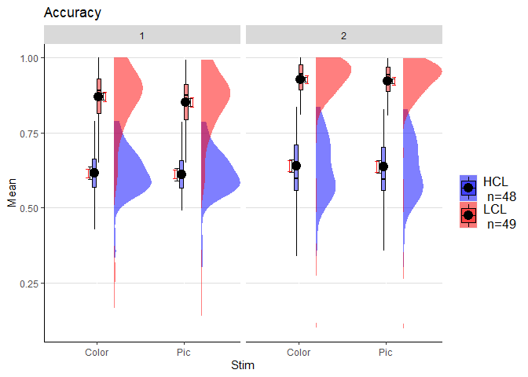<!-- -->

```r
two_w <- glmer(Mean ~ Time * Stim + (1 | ID), weights = count,
   family = binomial, data = EXP1)
emmeans1<- emmeans(two_w, pairwise ~ Time * Stim, adjust ="fdr", type = "response")
emmean_dataframe <- summary(emmeans1)$emmeans

Anova(three_w, type='III')
```

```
## Analysis of Deviance Table (Type III Wald chisquare tests)
## 
## Response: Mean
##                        Chisq Df Pr(>Chisq)    
## (Intercept)          27.5233  1  1.552e-07 ***
## Condition           107.5407  1  < 2.2e-16 ***
## Time                  8.6023  1   0.003357 ** 
## Stim                  0.1552  1   0.693569    
## Condition:Time       26.2623  1  2.981e-07 ***
## Condition:Stim        2.5317  1   0.111578    
## Time:Stim             0.0014  1   0.970086    
## Condition:Time:Stim   0.2982  1   0.585018    
## ---
## Signif. codes:  0 '***' 0.001 '**' 0.01 '*' 0.05 '.' 0.1 ' ' 1
```

```r
summary(emmeans1)
```

```
## $emmeans
##  Time Stim   prob     SE  df asymp.LCL asymp.UCL
##  1    Color 0.777 0.0185 Inf     0.739     0.812
##  2    Color 0.806 0.0168 Inf     0.771     0.837
##  1    Pic   0.771 0.0189 Inf     0.732     0.806
##  2    Pic   0.802 0.0170 Inf     0.767     0.833
## 
## Confidence level used: 0.95 
## Intervals are back-transformed from the logit scale 
## 
## $contrasts
##  contrast          odds.ratio     SE  df null z.ratio p.value
##  1 Color / 2 Color      0.841 0.0288 Inf    1  -5.048  <.0001
##  1 Color / 1 Pic        1.038 0.0351 Inf    1   1.114  0.3182
##  1 Color / 2 Pic        0.862 0.0294 Inf    1  -4.357  <.0001
##  2 Color / 1 Pic        1.234 0.0420 Inf    1   6.173  <.0001
##  2 Color / 2 Pic        1.024 0.0352 Inf    1   0.690  0.4901
##  1 Pic / 2 Pic          0.830 0.0283 Inf    1  -5.480  <.0001
## 
## P value adjustment: fdr method for 6 tests 
## Tests are performed on the log odds ratio scale
```

```r
# summary
sum <- sum_2 (EXP1, 'Stim', 'Condition', 'Mean')
sum
```

```
## # A tibble: 4 x 7
## # Groups:   Stim [2]
##   Stim  Condition     n  mean     sd      se     ic
##   <fct> <fct>     <int> <dbl>  <dbl>   <dbl>  <dbl>
## 1 Color HCL         192 0.623 0.0917 0.00662 0.0130
## 2 Color LCL         196 0.875 0.153  0.0109  0.0215
## 3 Pic   HCL         192 0.619 0.0923 0.00666 0.0131
## 4 Pic   LCL         196 0.863 0.154  0.0110  0.0217
```

```r
pl <- plotti(EXP1, emmean_dataframe, 'Stim', 'Mean', 'Time', 'prob', 'Stimulus')
```


-----------------------------------------------------------------------------------

## CORRELATIONS


```r
##########################################
  ### CORRELATIONS ###
#########################################C
# 
# # Create 1 big dataframe
# names(VAS)[names(VAS)=="Mean"] <- "VASf"
# names(EXP)[names(EXP)=="Mean"] <- "Acc"
# df <- merge(VAS, EXP, by = c('Day','Time', 'Condition', 'ID'))
# 
# length(unique(df$ID[df$Condition=='HCL']))
# length(unique(df$ID[df$Condition=='LCL']))
# 
# ### VAS-f ###
# 
# ## CORR VAS-f Mean score between Day 1 and Day 2 (test-retest reliability)
# # HCL 
# Day1 <- VAS$VASf[VAS$Day==1 & VAS$Condition=='HCL']
# Day2 <- VAS$VASf[VAS$Day==2 & VAS$Condition=='HCL']
# VASfHCL <- corrplot(Day1, Day2, 'Day1', 'Day2') +ggtitle('VASf HCL')
# #LCL
# Day1 <- VAS$VASf[VAS$Day==1 & VAS$Condition=='LCL']
# Day2 <- VAS$VASf[VAS$Day==2 & VAS$Condition=='LCL']
# VASfLCL <- corrplot(Day1, Day2, 'Day1', 'Day2') +ggtitle('VASf LCL')
# # cor.test(VAS$VASf[VAS$Condition=='HCL'], VAS$VASf[VAS$Condition=='LCL'],  method="spearman")# not Pearson because: not normal distribution
# # cor.test(VAS$Mean[VAS$Condition=='HCL'], VAS$Mean[VAS$Condition=='LCL'],  method="kendall")
# 
# ## CORR VAS-f delta between Day 1 and Day 2 
# #HCL
# Day1 <- VAS$VASf[VAS$Day==1 & VAS$Condition=='HCL' & VAS$Time==2]- VAS$VASf[VAS$Day==1 & VAS$Condition=='HCL' & VAS$Time==1]
# Day2 <- VAS$VASf[VAS$Day==2 & VAS$Condition=='HCL' & VAS$Time==2]- VAS$VASf[VAS$Day==2 & VAS$Condition=='HCL' & VAS$Time==1]
# VASf_delta_HCL <- corrplot(Day1, Day2, 'Day1', 'Day2') +ggtitle('VASf delta HCL')
# #LCL
# Day1 <- VAS$VASf[VAS$Day==1 & VAS$Condition=='LCL' & VAS$Time==2]- VAS$VASf[VAS$Day==1 & VAS$Condition=='LCL' & VAS$Time==1]
# Day2 <- VAS$VASf[VAS$Day==2 & VAS$Condition=='LCL' & VAS$Time==2]- VAS$VASf[VAS$Day==2 & VAS$Condition=='LCL' & VAS$Time==1]
# VASf_delta_LCL <- corrplot(Day1, Day2, 'Day1', 'Day2') +ggtitle('VASf delta LCL')
# 
# VASfCORR <- ggarrange(VASfHCL, VASfLCL, VASf_delta_HCL, VASf_delta_LCL + rremove("x.text"), 
#           labels = c("A", "B", "C", "D"),
#           ncol = 2, nrow = 2)
# ggsave(VASfCORR, file=paste0(plotPrefix, "VASf_CORR.jpg"), width = 2500, height = 1500, dpi = 300, units = "px")
# VASfCORR
# 
# ### Accuracy ###
# 
# ## CORR Accuracy Day 1 and Day 2  (test-retest reliability)
# #HCL
# Day1 <- EXP$Acc[EXP$Day==1 & EXP$Condition=='HCL' & EXP$Time==2]- EXP$Acc[EXP$Day==1 & EXP$Condition=='HCL' & EXP$Time==1]
# Day2 <- EXP$Acc[EXP$Day==2 & EXP$Condition=='HCL' & EXP$Time==2]- EXP$Acc[EXP$Day==2 & EXP$Condition=='HCL' & EXP$Time==1]
# EXPHCL<-corrplot(Day1, Day2, 'Day1', 'Day2') +ggtitle('Performance HCL')
# #LCL
# Day1 <- EXP$Acc[EXP$Day==1 & EXP$Condition=='LCL' & EXP$Time==2]- EXP$Acc[EXP$Day==1 & EXP$Condition=='LCL' & EXP$Time==1]
# Day2 <- EXP$Acc[EXP$Day==2 & EXP$Condition=='LCL' & EXP$Time==2]- EXP$Acc[EXP$Day==2 & EXP$Condition=='LCL' & EXP$Time==1]
# EXPLCL<-corrplot(Day1, Day2, 'Day1', 'Day2') +ggtitle('Performance LCL')
# 
# ## CORR Accuracy delta between Day 1 and Day 2 
# #HCL
# Day1 <- EXP$Acc[EXP$Day==1 & EXP$Condition=='HCL' & EXP$Time==2]- EXP$Acc[EXP$Day==1 & EXP$Condition=='HCL' & EXP$Time==1]
# Day2 <- EXP$Acc[EXP$Day==2 & EXP$Condition=='HCL' & EXP$Time==2]- EXP$Acc[EXP$Day==2 & EXP$Condition=='HCL' & EXP$Time==1]
# EXP_DELTA_HCL<- corrplot(Day1, Day2, 'Day1', 'Day2') +ggtitle('Performance delta HCL') # negative correlation: when high in day 1, low in day 2
# #LCL
# Day1 <- EXP$Acc[EXP$Day==1 & EXP$Condition=='LCL' & EXP$Time==2]- EXP$Acc[EXP$Day==1 & EXP$Condition=='LCL' & EXP$Time==1]
# Day2 <- EXP$Acc[EXP$Day==2 & EXP$Condition=='LCL' & EXP$Time==2]- EXP$Acc[EXP$Day==2 & EXP$Condition=='LCL' & EXP$Time==1]
# EXP_DELTA_LCL<-corrplot(Day1, Day2, 'Day1', 'Day2') +ggtitle('Performance delta LCL') # positive correlation: when high in day 1, high in day 2
# 
# EXPCORR <- ggarrange(EXPHCL, EXPLCL, EXP_DELTA_HCL, EXP_DELTA_LCL + rremove("x.text"), 
#           labels = c("A", "B", "C", "D"),
#           ncol = 2, nrow = 2)
# ggsave(EXPCORR, file=paste0(plotPrefix, "EXP_CORR.jpg"), width = 2500, height = 1500, dpi = 300, units = "px")
# EXPCORR


# ### VAS-f * Acc ###
# ## CORR delta (change) VAS-f and delta Acc
# #HCL
# VAS_f <- df$VASf[df$Time==2 & df$Condition=='HCL'] - df$VASf[df$Time==1 & df$Condition=='HCL']
# ACC<- df$Acc[df$Time==2 & df$Condition=='HCL'] - df$Acc[df$Time==1 & df$Condition=='HCL']
# DELTAHCL<- corrplot(VAS_f, ACC, 'VASf delta', 'Performance delta') +ggtitle('delta correlations HCL') # no correlation: change before-after test in VASf no correlation with obj CF changes 
# #LCL
# VAS_f <- df$VASf[df$Time==2 & df$Condition=='LCL'] - df$VASf[df$Time==1 & df$Condition=='LCL']
# ACC<- df$Acc[df$Time==2 & df$Condition=='LCL'] - df$Acc[df$Time==1 & df$Condition=='LCL']
# DELTALCL<- corrplot(VAS_f, ACC, 'VASf delta', 'Performance delta') +ggtitle('delta correlations LCL') 
# 
# DELTACORR<- ggarrange (DELTAHCL, DELTALCL+ rremove('x.text'), labels= c('A', 'B'))
# ggsave(DELTACORR, file=paste0(plotPrefix, "DELAT_CORR.jpg"), width = 2500, height = 1500, dpi = 300, units = "px")
# DELTACORR
```


